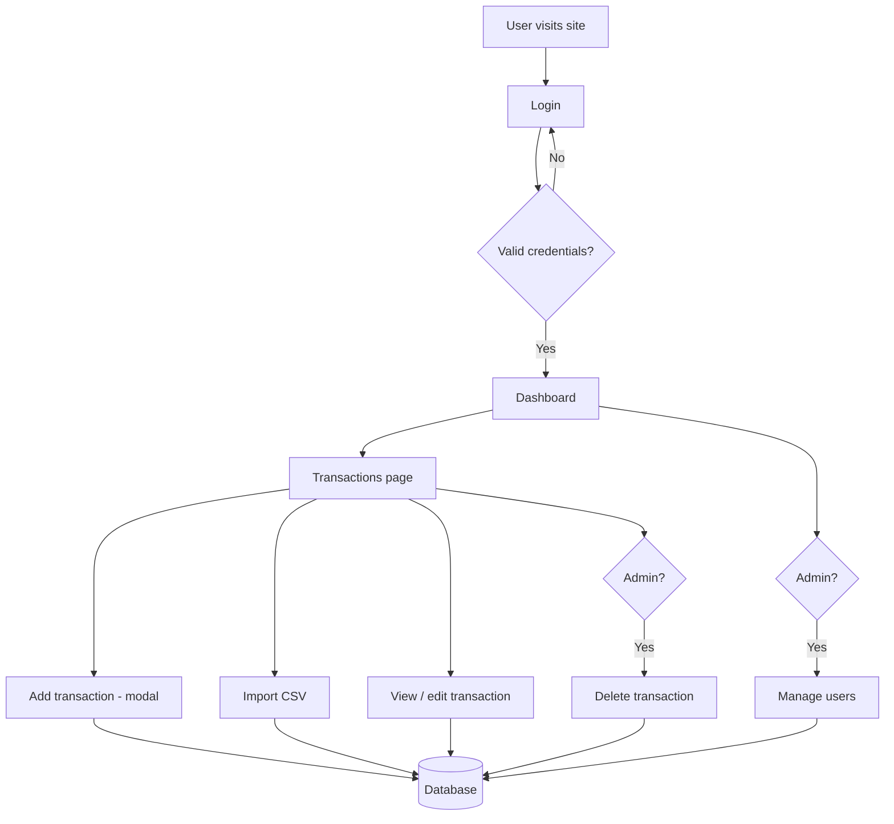

# Cashflow — Application Overview

A cashflow tracker for a dental clinic: records patient payments (manually or via CSV import), shows a dashboard of income trends and clinic activity, and restricts sensitive actions by user role.

## Tech stack

| Layer | Choice |
|---|---|
| Framework | Next.js 16 (App Router), React 19, TypeScript |
| Styling | Tailwind CSS v4 (no UI/component library — hand-built modal, forms, charts) |
| Database | Neon (serverless Postgres) + Drizzle ORM |
| Auth | Auth.js / NextAuth v5, Credentials provider, JWT sessions |
| Validation | Zod |
| CSV parsing | Papaparse |

## Roles & permissions

| Role | Add / import transactions | Edit transactions | Delete transactions | Manage users |
|---|---|---|---|---|
| **Admin** | ✅ | ✅ | ✅ | ✅ |
| **Dentist** | ✅ | ✅ | ❌ | ❌ |
| **Staff** | ✅ | ✅ | ❌ | ❌ |

Enforced twice: hidden in the UI, and re-checked in every server action, so permissions hold even if someone bypasses the UI.

## Core features

- **Auth** — email/password login, session-protected `/cashflow/*` routes, admin-only user creation (no public sign-up).
- **Dashboard** (`/cashflow`) — stat cards plus charts: cashflow trend, payment methods, top procedures, and patient stats (all computed from real transactions). Income vs. expense and expense-by-category charts are marked **"Sample data"** — expenses aren't tracked yet.
- **Transactions** (`/cashflow/transactions`) — table of all records; add via a modal; view, edit, or (admin only) delete each one; import a CSV in bulk.
- **User management** (`/cashflow/users`, admin only) — create accounts, change roles, remove users.

## Data model

- **`transactions`** — date, visit ID, patient name, procedure, dentist, payment type, amount paid, VAT, merchant fee, withholding tax, net collection.
- **`users`** — name, email, password hash, role (`admin` / `dentist` / `staff`).

## Process flow

Every write (add, edit, delete, CSV import, user management) goes straight to Postgres — no local/offline state, so the dashboard and table always reflect the live database.

## Known gaps

- No `expenses` table yet — expense figures on the dashboard are placeholder data.
- No dedicated `patients` table — patient counts are estimated by matching name strings.
- "Forgot password" page exists but isn't wired to a real reset flow.
